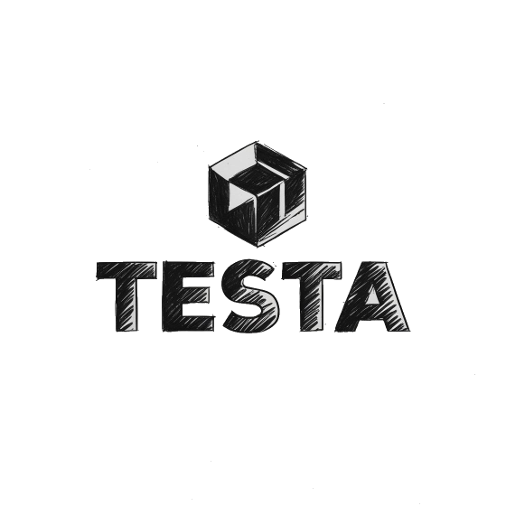

# Advanced Programming Techniques project suggestion 
## Extending a Domain-Specific Language with LSP Support

The goal of this project is to enhance an existing Domain-Specific Language (DSL) by implementing support for the Language Server Protocol (LSP). This will provide advanced features such as autocompletion, go-to-definition, real-time diagnostics, and more, akin to the functionality available for mainstream programming languages in modern Integrated Development Environments (IDEs).

### Approach

1. Refactor the Lexer and Parser.

    The existing DSL will need significant refactoring to expose richer information for LSP functionalities. Specifically, we’ll need to ensure that the Lexer and Parser are capable of producing the necessary metadata (e.g., symbols, types, scopes) that LSP tools can utilize.

2. Implement Semantic Analysis

    A key aspect of LSP is providing real-time feedback about errors and warnings as code is written. To do this effectively, we need to extend the semantic analysis phase of the compiler pipeline.
    This semantic layer will also be responsible for generating the diagnostics (error messages, warnings, etc.) that can be sent back to the client when a user is typing code.

3. LSP Server Implementation

    LSP server will be implemented using the `tower-lsp` library in Rust. This server will communicate with IDEs and text editors to provide language features.

4. Testing and Evaluation

    The integration will be tested by using common text editors with LSP support (e.g., Visual Studio Code, Sublime Text) to ensure that the implemented features (autocompletion, go-to-definition, diagnostics) work as expected.

A brief documentation is provided below, explaining the DSL syntax and functionality.

### Architecture

- `testa-core` - The Core module contains the underlying business logic, which includes the lexer, parser, semantic analyzer, and AST (Abstract Syntax Tree).
- `testa-cli` - The CLI acts as the entry point of the program. It is responsible for parsing the command-line parameters and executing the program accordingly.
- `testa-interpreter` - The Interpreter is responsible for processing the DSL templates, evaluating expressions, and generating structured data for generator.
- `testa-lsp`- Will be added to provide Language Server Protocol (LSP) support
- `testa-generation` - The Generator takes the data produced by the Interpreter and formats it into the desired output (e.g., JSON, CSV, XML).


### Planned extensions

1. Attribute systems - Add metadata to fields and templates using attributes.
2. References - Allow templates to reference each other. This can be done by referencing fields directly or by using lists of field names.
3. Module system - Enable code serialization for reuse in the CLI or via imports. The idea is to use the MessagePack format.
4. Grammar Extensions - Future extensions to the language grammar will be proposed and discussed in the Issues section of the repository. This includes ideas for new syntax, features, or modifications to the existing grammar.
5. Additional Output Formats - Extend support for generating data in formats beyond CSV, including JSON, YAML, SQL insert scripts, and others.

### References:
- LSP Specification (3.17) : https://microsoft.github.io/language-server-protocol/specifications/lsp/3.17/specification/
- tower-lsp: https://docs.rs/tower-lsp/latest/tower_lsp/
- Message pack format: https://msgpack.org/


# testA

<p align=center>
  
</p>

TestA is a domain-specific language designed for generating structured test data in formats like JSON, CSV, and XML. It provides a simple, C-like syntax for defining templates, resources, enums, and generation rules, enabling quick and expressive data mockups for testing, prototyping, or seeding.

```
@output csv {
    header = false;
    delimiter = "\n";
}

enum Role { Admin, User, Guest }

resource Names {
    first = ["Ana", "Marko"];
    last = ["Petrović", "Nikolić"];
}

template User {
    id = $uuid();
    name = $pick(Names.first) + " " + $pick(Names.last);
    role = $pick(Role);
}

@generate User [10];

```

## Getting started
Before you begin, ensure you have `Rust` and `Cargo` installed:
```bash
rustc --version
cargo --version
```
Clone this repository:
```
git clone https://github.com/lazarnagulov/testa.git
cd testa
```
Compile project:
```
cargo build
```
Run the project:
```
cargo run -- ./examples/01_anonymous_generate.testa
```

## Syntax

### Directives

Directives are declared using the `@<directive> <value>;` syntax:

```
@seed 42;
@locale "en_US";
```

You add additional options for directive with `{ key = <value:expr>; ... }`.

```
@output csv {
    delimiter = ";";
    quote = "\"";
    header = true;
}
```

## Data Types

Currently, there are 4 available data types that can be used to express and generate random values:
- int
- string
- float
- bool

### Adding Constraints

You can also add constraints to these data types to further control the values they generate. The syntax for adding a constraint is:

```
<type> [<condition1>, <condition2>]
```

Example:

```
// Generate integers from 1 to 18 (inclusive)
int [range = 1..=18]
```

In the above example:

- The `range` constraint ensures that the generated integer will be between 1 and 18 (inclusive).

Apply similar constraints to other data types as well.

Check example: [constraints](./examples/05_constraints.testa),

### Lists

Define list with syntax: `[<type>[<constraint1>, <constraint2>...]][<constraint1>, <constraint2>...]`.

Example

```
[int[range=1..=100]][count=1..5]
```
 
In the above example:

- The `range` constraint ensures that the generated integers will be between 1 and 100 (inclusive).
- The `count` constraint ensures that the generated list constain between 1 and 5 (exclusive) items. 

> [!NOTE]
> Defining multidimensional lists is also possible, such as `[[int[min=0]][count=0..5]][count=1..=5]`, but using type aliasing is recommended.


Check examples: [lists](./examples/08_lists.testa), [multidimensional lists](./examples/09_multidimensional_list.testa).

### Custom types

Define custom types by adding constraints to existing (fundamental) types using this syntax: `type <name> = <type>[<constraint1>, <constraint2>...]`.
Example:
```
type PositiveInt = int [range=1..=1024];
type PositiveIntList = [PositiveInt][count=1..=10];
```
This defines a PositiveInt type as an int constrained to values from 1 to 1024 (inclusive).
To extend an existing user-defined type with additional constraints, use: `type <name> = extend <type> with [<constraint1>,<constraint2>..]`
Example:
```
type PositiveEvenInt = extend PositiveInt with [multiple_of=2];
```
This lets you build on previously defined types by layering more rules on top.

> [!TIP]
> Now that ugly list example can be written as `[PositiveIntList][count=1..5]`.

Check example: [types](./examples/06_constraint_types.testa).

## String patterns

String patterns define the structure of a string. In these patterns, char-
acters wrapped in `${}` represent placeholders where random values will be
generated. Placeholders are:
1. ${a} generates a random lowercase letter (a-z)
1. ${A} generates a random uppercase letter (A-Z)
1. ${#} generates a random digit (0-9)
Either repeat the placeholder multiple times or use [<number>].
```
string_pattern "${a[4]AA#[3]}@${a[5]}.com";
string_pattern "${aaaaAA###}@${aaaaa}.com";
```

Check example: [string_pattern](./examples/10_string_pattern.testa). 

## Templates

Templates are declared using `template <name> [: <parent_name>] { key = <value:expr>; }`.

```
template User {
    first_name = string;
    last_name = string;
    age = int;
}
```
Templates can be extended using `: <parent name>`.
```
template Student : User {
    index_id: string;
    override age: int [range=19..=30];
}
```
> [!NOTE]
> Fields are overridden by default. Use the `override` keyword to prevent the warning.

Check examples: [template](./examples/02_generate_template.testa).

## Enum

Enums are declareed using `enum <name> { <variant1> [=> <wight:expr>]; <variant2> [=> <wight:expr>] ... }`

```
// Admin has default weight (1)
enum Role { 
    User => 20;
    Admin;
    Developer => 30; 
}

// Generates random variant of 'Role'
template User {
    role = Role;
}
```

Check examples: [enum](./examples/03_enum.testa), [weight_enum](./examples/04_weight_enum.testa).


## Resource
todo...

## Generate
todo...
```
@generate <template_name|_> [<count>] ; | { key = <value:expr> }
```

## References:
- [Interpreter in GO](https://interpreterbook.com/)
- [Crafting interpreters](https://craftinginterpreters.com/)
